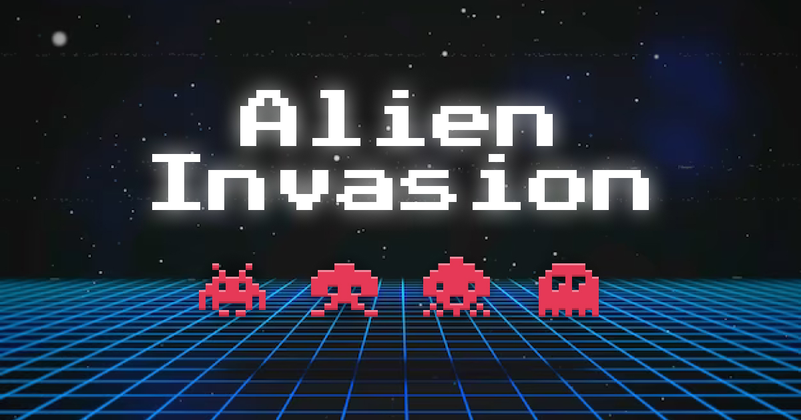
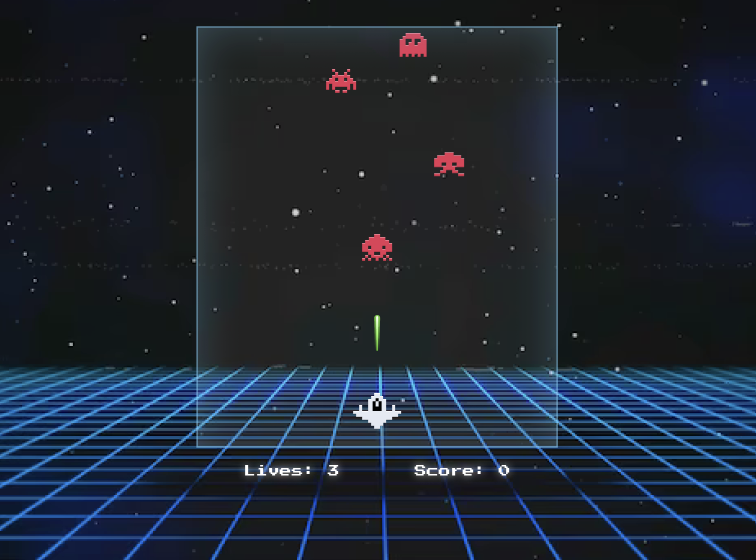

# Alien Invasion Game

## Description

Alien Invasion is a simple browser-based game where you control a spaceship to shoot down incoming alien enemies. The game provides an exciting 80s retro gaming experience with its classic arcade-style graphics and controls.
Enjoy the adrenaline-pumping action of Alien Invasion and embark on a journey back to the golden age of arcade gaming!

- Dynamic Gameplay: The game dynamically adjusts difficulty based on your performance, providing a challenging and engaging experience.
- Highscore Tracking: Compete against yourself to achieve the highest score. Your best score is saved locally for future sessions.

## How to Play

- Control spaceship with <kbd>←</kbd> and <kbd>→</kbd> arrow keys
- Shoot with <kbd>spacebar</kbd>
- Earn points with each destroyed alien

## Game Preview

## How to Run

To play the game, simply open the `index.html` file in your web browser.

## Credits

Game created by [Arale](https://github.com/justArale).
